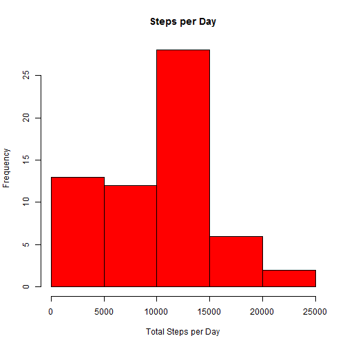
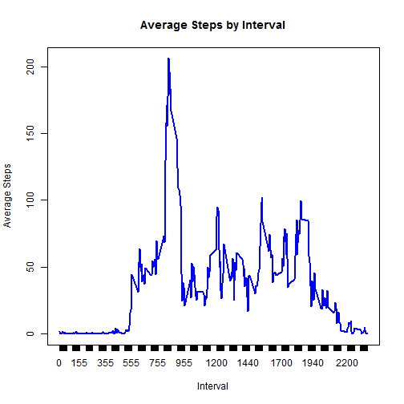
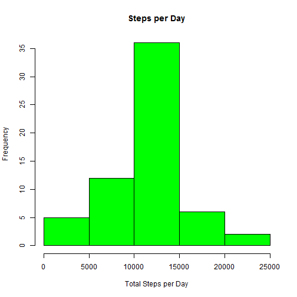
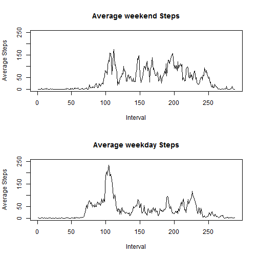

#Reproducible Research Peer Assignment 1

With the ability to collect a large amount of data about personal movement using devices such as the Fitbit, Fuelband, or Jawbone up, this assignment explores possible analysis the data. 

The data includes:

1. steps:Number of steps taking in a 5-minute interval 
2. date: The date on which the measurement was taken in YYYY-MM-DD format
3. interval: Identifier for the 5-minute interval in which measurement was taken

## Loading and preprocessing the data


```r
setwd("C:/Users/558966/Documents/Coursera")
activity <- read.csv("activity.csv")
```
## What is mean total number of steps taken per day?


```r
daily.activity <- tapply(activity$steps, list(activity$date),sum, na.rm=TRUE)
hist(daily.activity, xlab = "Total Steps per Day",ylab = "Frequency", main = "Steps per Day", col="red")
```

 


The mean and median are report below:

```r
mean(daily.activity, na.rm=TRUE)
```

```
## [1] 9354
```

```r
median(daily.activity, na.rm=TRUE)
```

```
## [1] 10395
```

## What is the average daily activity pattern?

```r
interval.activity <- sapply(with(activity, split(steps, interval)), mean, na.rm=TRUE)

plot(as.table(interval.activity), type="l",xlab="Interval", ylab="Average Steps", main="Average Steps by Interval", col="blue")
```

 


The 835th Interval has the most steps:

```r
interval.activity[which.max(interval.activity)]
```

```
##   835 
## 206.2
```

##Imputing missing values
There are 2304 missing values

```r
sum(is.na(activity))
```

```
## [1] 2304
```
By filling in missing values with the average steps for each interval...

```r
new.activity <- activity
for(i in 0:max(new.activity$interval)){
  new.activity$steps[new.activity$interval == i & is.na(new.activity$steps)]  <- mean(activity$steps[new.activity$interval == i],na.rm=T)
}

new.daily.activity <- tapply(new.activity$steps, list(new.activity$date),sum)
hist(new.daily.activity, xlab = "Total Steps per Day",ylab = "Frequency", main = "Steps per Day", col="green")
```

 


The new mean and median are: 

```r
mean(new.daily.activity)
```

```
## [1] 10766
```

```r
median(new.daily.activity, na.rm=TRUE)
```

```
## [1] 10766
```
## Are there differences in activity patterns between weekdays and weekends?


```r
newer.activity <- activity
newer.activity$date<- as.Date(newer.activity$date, "%Y-%m-%d")
newer.activity$Day <- weekdays(newer.activity$date)

newer.activity$Day.Type <- ifelse(newer.activity$Day == "Monday" | newer.activity$Day == "Tuesday" | newer.activity$Day == "Wednesday" | newer.activity$Day == "Thursday" | newer.activity$Day == "Friday","Weekday","Weekend")
weekend <- aggregate(steps ~ interval, data = newer.activity[newer.activity$Day.Type == "Weekend",], mean, na.rm = TRUE)
weekday <- aggregate(steps ~ interval, data = newer.activity[newer.activity$Day.Type == "Weekday",], mean, na.rm=TRUE)

par(mfrow = c(2, 1))
plot(weekend$steps, type = "l", main = "Average weekend Steps", xlab="Interval", ylab = "Average Steps", ylim = c(0, 250))
plot(weekday$steps, type = "l", main = "Average weekday Steps", xlab="Interval", ylab= "Average Steps",ylim = c(0, 250))
```

 
